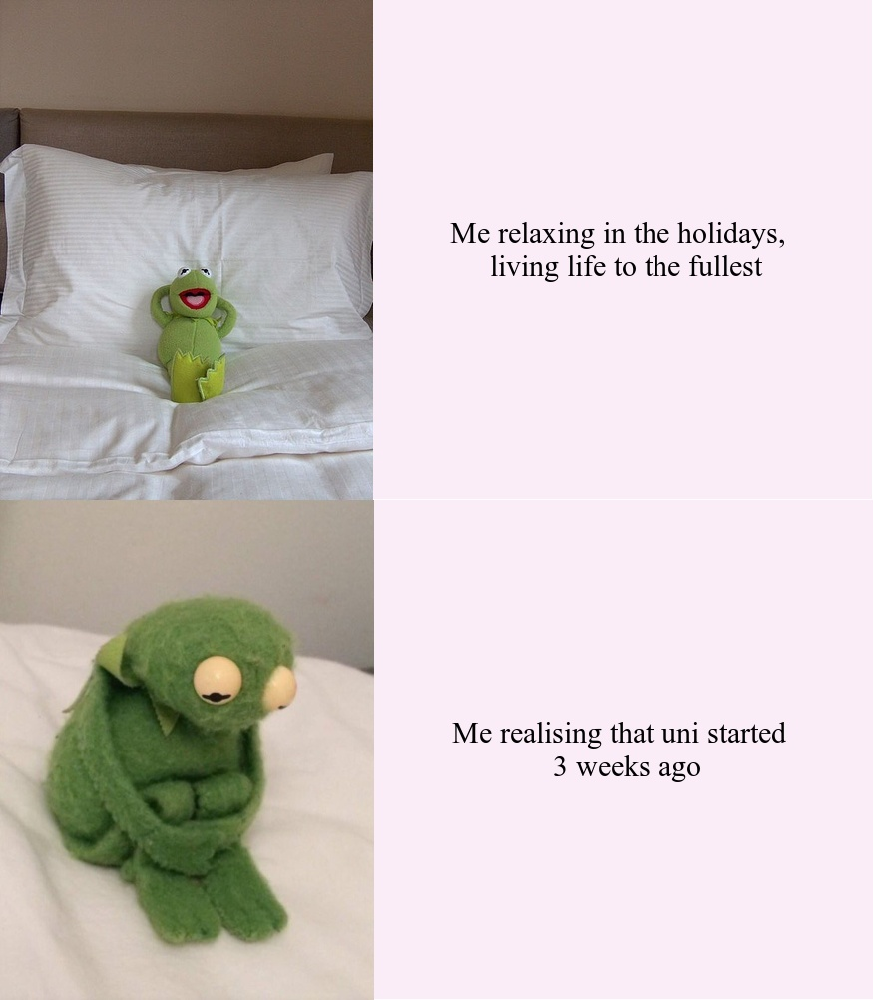

# Welcome to the first part of my assignment!
_Making the meme_
```r
library(magick)
#Reading the images needed for the meme
#box 1
kermit_relax <- image_read(path="https://i.imgflip.com/22i5u3.jpg") %>%
  image_resize(374)


#box 3
kermit_depressed<-image_read(path="https://pbs.twimg.com/media/CzhkuBdUcAIO721?format=jpg&name=large") %>%
  image_scale(399) %>%
  image_crop(375)
#pink box for the text, box 2
pink_box_happy<-image_blank(
  width=500,
            height=500,
            color="#faedf8")%>%
  image_annotate(text="Me relaxing in the holidays, \n living life to the fullest",
                 color="#000000",
                 size="30",
                 gravity="center",
                 font="serif")
#box 4

pink_box_sad<-image_blank(width=500,
                     height=500,
                     color="#faedf8")%>%
  image_annotate(text="Me realising that uni started \n 3 weeks ago",
                 color="#000000",
                 size="30",
                 gravity="center",
                 font="serif")

Kerm_vector1<-c(kermit_relax,pink_box_happy)
top_row=image_append(Kerm_vector1)

Kerm_vector2<-c(kermit_depressed,pink_box_sad)
bottom_row=image_append(Kerm_vector2)


Meme<-c(top_row,bottom_row) %>%
  image_append(stack=TRUE)

image_write(Meme,"my_kermit_meme.png")
```

### Meme Motivation 
As you can see above, this meme was inspired by **Kermit the frog**. **Kermit** is a well known muppet often featured on **Seaseme Street**. My inspiration from this meme is has two parts.
1. Firstly, I spent most my time in the holidays relaxing and working while slightly dreading uni. Then all of a sudden a couple of months go by and I'm already 3 weeks into uni 🤡. 
  This meme is just meant to reflect how I feel in a funny yet sad way.
2. Secondly, a bit personal, but in my first year of university I remember working on a group project at around 2am and on **GoogleDocs** someone joins me. I didn't know them too well but we just randomly started
 posting Kermit memes and that led to us being friends even a few years later 😄.
 
### Originality 
* This meme is orignial as for almost all of the Kermit memes on the _internet_ they are only one paneled reaction images. As opposed to a 4 panel Meme format which was mostly popular in 2012.
I also added a touch of originality by changing the typical impact font to serif and changing the background colour to pink!
If you want to see more Kermit Memes https://knowyourmeme.com/memes/kermit-the-frog here is a good place!

Below are some images of Kermit memes that are just one panels.


